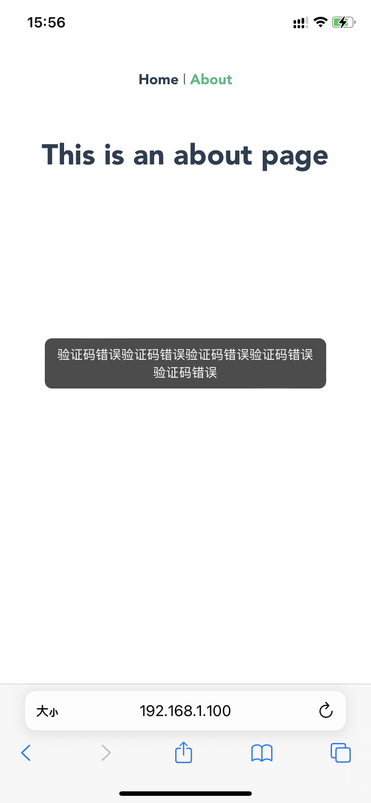
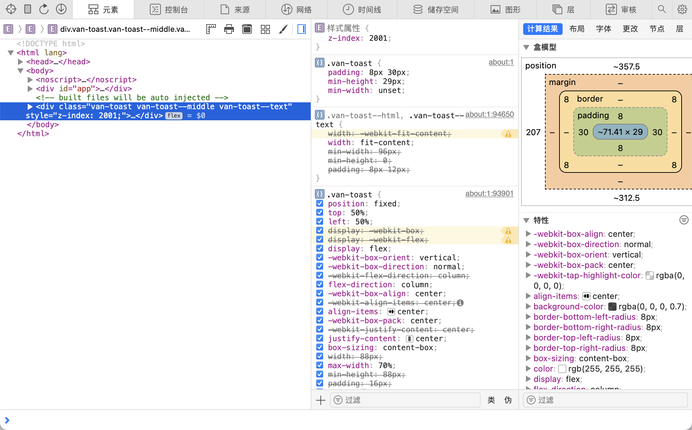

# vue2-vant-toast-test

## 太长不看版

* `box-sizing: border-box` 和 `width: fit-content` 搭配使用时，不同版本的Safari计算出来的content宽度对padding的考虑不一致。
* 在iPhone 6Plus(iOS 12.4)上，浏览器根据`width: fit-content`计算出来的宽度作为外层盒子的宽度，再减去padding作为内容区的宽度，这已经不算是fit-content了。
* 在iPhone 11(iOS 16)上，浏览器根据`width: fit-content`计算出来的宽度作为内容区的宽度，再加上padding作为外层盒子的宽度，这才是真正的fit-content。

## vant toast 的默认样式

### 在电脑浏览器演示


默认样式：

```css
.van-toast--text {
    min-width: 96px;
    min-height: 0;
    width: fit-content;
    padding: 8px 12px;
}

.van-toast {
    box-sizing: content-box;
    max-width: 70%;
    width: 88px;
    padding: 16px;
}

.computed {
    min-width: 96px;
    max-width: 70%;
    width: fit-content;
    min-height: 0;
    box-sizing: content-box;
    padding: 8px 12px;
}
```

### 在 iPhone11(iOS 16) 演示

 


再来看看多行的情况




可以看出页面宽度为414px，toast的最大宽度为70%，约289px。因为 `box-sizing: content-box`， 所以最大宽度不包括padding。

## 修改样式

```scss
.van-toast {
    box-sizing: border-box;
    padding: 8px 30px;
    // 因为是border-box，所以min-height包括了上下padding
    min-height: 45px;
    // 移除最小宽度限制
    min-width: unset;
}
```

### 在 iPhone11(iOS 16) 演示


效果正常，再来看多行的情况


可以看出页面宽度为414px，toast的最大宽度为70%，约289px。因为 `box-sizing: content-box`， 所以最大宽度包括了padding，内容区只剩下229px。

### 在iPhone 6 Plus(iOS 12.4) 演示


可以看到样式大溃败！我们先把自定义的toast样式去掉，观察一下。


内部"验证码错误"的尺寸约为71.41x20，`vant-toast__text` 这个class本身只写了margin-top这个样式，大多样式都是继承来的。


因为 `min-width: 96px`，`width: fit-content` 不起作用，我们加多几个字看看：


从上图就可以看出 fit-content 的自适应作用。我们再把自定义样式逐条启用。最终锁定为 `box-sizing: border-box` 导致的问题。


从前面实验可以知道，内部"验证码错误"的尺寸约为71.41x20，浏览器根据 `width: fit-content` 计算出外部盒子的宽度为71.41px，但是因为 `box-sizing: border-box`，所以减去padding之后，内部的宽度变成了11.41px！


当然内部一个字的最小宽度为14px，所以内部盒子的宽度浏览器计算出来是14.28px。


把padding设置为0，显示正常！

至此，我们可以下结论，在iPhone 6Plus(iOS 12.4)上，如果设置了`box-sizing: border-box`，浏览器对于`width: fit-content`的计算是有问题的，计算出来的宽度再减去padding作为内容区的宽度，这已经不算是fit-content了。

## 修改后的方案

* 不使用 `box-sizing: border-box` 确保 `width: fit-content` 在不同版本的Safari正常生效。
* 因为移除了最小宽度限制，所以toast内部的div的文字不会有左右两边多余的空白，所以只需考虑上下padding。对于 `box-sizing: content-box`，min-height只针对内容区，所以要把上下padding部分减去。

```scss
.van-toast {
    padding: 8px 30px;
    min-height: 29px;
    // 移除最小宽度限制
    min-width: unset;
}
```

## 在 iPhone11(iOS 16) 演示




再看看多行的情况：


### 在iPhone 6 Plus(iOS 12.4) 演示


